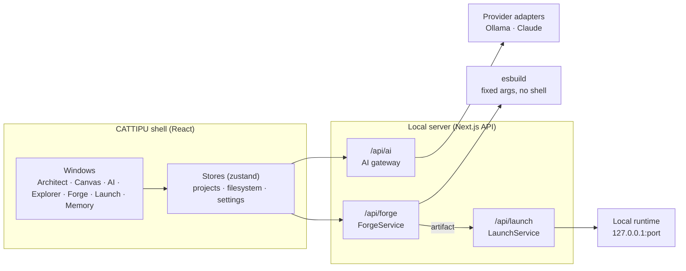

<div align="center">


# CATTIPU OS

**The operating system for software creators.**

Plan it. Build it. Run it. All in one 1998-style engineering workstation,
with AI working for your project instead of owning it.


*A fast 90s-style spot made from real recordings of CATTIPU, cut with
Motion. [Watch the full spot (MP4)](docs/media/cattipu-ad.mp4).*

</div>

---


<p align="center"><sub>A project built by Forge (left) and running in Launch (right), with the desktop widgets floating on the wallpaper. Captured from the live app at 1600×900.</sub></p>

## The agenda

**Anyone should be able to turn an idea into a working app on their own
computer, without feeling overwhelmed.**

1. **Easy first.** A beginner types an idea in plain words and gets a
   running app. Planning, files and builds are there when you want them,
   never in your way.
2. **Runs locally.** Your projects, your code and your AI stay on your
   machine. No cloud account, no subscription, works offline.
3. **The project remembers.** Every plan, decision, build and run is kept
   in Project Memory, so the AI understands your project better the longer
   you work on it.
4. **Any model.** A local model by default; bring your own key for a
   frontier model (Claude, OpenAI, Gemini) when you want more power.
   CATTIPU is the workshop that makes any model useful.

**The test we build against:** someone who has never written code installs
CATTIPU with one click, types one sentence, and has their app running on
their own laptop within minutes, without help. We are not there yet; the
[roadmap](docs/ROADMAP.md) is the path.

## What is CATTIPU?

Building software means juggling a planning doc, a design tool, an IDE, a
terminal, a browser and an AI chat that forgets your project every time.
None of them share one understanding of what you are building.

CATTIPU is a single operating environment where **the Project is the
primary object**. Planning, design, files, AI, builds and running apps all
belong to the same project, and every tool sees the same state:

```text
Architect  ──▶  Canvas  ──▶  Forge  ──▶  Launch  ──▶  Live
  plan          design        build        run          (next)
```

AI models are **interchangeable workers** behind adapters (local Ollama
today, Claude ready, more to come). They read the project's memory, and
the project never belongs to the model.

## A tour

| | |
|---|---|
|  |  |
| **Boot.** The original CATTIPU boot sequence. | **Desktop.** Projects window, rail, widgets, status bar. |
|  |  |
| **Architect.** Describe the software; get summary, features, architecture, data model, stack, APIs, roadmap. | **Canvas.** The architecture as a layout you can arrange. |
|  |  |
| **AI Console.** Project-scoped AI (here a local Ollama model) that can propose files. | **Explorer.** One shared filesystem; open and edit the project's source. |
|  |  |
| **Forge.** A real esbuild build: diagnostics, artifact, history. | **Launch.** The build runs as a real local app on `127.0.0.1`. |
|  |  |
| **The result.** The app CATTIPU built and launched. | **Same app, dark mode.** Served live by Launch. |
|  |  |
| **Memory.** Notes, prompts and conversations every AI reads; Forge and Launch file their results here. | **Floating widgets** on any wallpaper; minimise, close and add back. |
|  |  |
| **Wallpaper Studio.** Six period-true surfaces. | **Notification Center.** Every build and launch, in one history. |

## How you use it

1. **Projects** → name your project → **CREATE**. It gets a workspace and
   becomes the active project.
2. **Architect** → describe what you want → **Generate** to get the plan.
3. **Ask AI** in Architect → talk it through; the AI can **propose files**,
   and **Apply** writes them into the project.
4. **Explorer** → open and edit the files.
5. **Forge** → **Build**: a real build with real diagnostics.
6. **Launch** → **Launch**, then **Open** to use the app; **Stop** when done.

Everything is remembered per project: builds, launches, notes and
conversations. Right-click the desktop for folders, window arrangement
(Cascade, Tile, Restore All), wallpapers and widgets.

## Getting started

Requires **Node 20+** and npm.

```bash
git clone https://github.com/anirvamn/cattipu-os.git
cd cattipu-os
npm install
npm run dev
```

Open <http://localhost:3000>.

> Install with **npm** (`package-lock.json` is authoritative). `pnpm install`
> produces an incomplete `node_modules` that breaks linting.

### Connect an AI

CATTIPU talks to models through its AI gateway. Configure it in
`.env.local` (never commit it):

| Provider | Setup |
|---|---|
| **Ollama** (local, default in development) | Install [Ollama](https://ollama.com), `ollama pull qwen2.5-coder:1.5b`, keep it running. Optional: `OLLAMA_MODEL`, `OLLAMA_BASE_URL`, `OLLAMA_NUM_GPU=0` for CPU-only machines. |
| **Claude** | `AI_PROVIDER=claude` and `ANTHROPIC_API_KEY=…`; optional `CATTIPU_CLAUDE_MODEL`. |

Forge and Launch run real processes on your machine. They are on under
`npm run dev`; under `npm start` they stay off unless `FORGE_ENABLED=1`
and `LAUNCH_ENABLED=1`.

## Architecture



Ground rules the code is built on:

- **One owner per concern.** One window manager, one filesystem, one
  project store, one notification system, one menu component.
- **Derived, not stored.** Progress, status and build state are computed
  from what a project contains, so nothing on screen goes stale.
- **No arbitrary execution.** Builds and launches run fixed executables
  with fixed argument arrays, no shell, a minimal environment, and
  confinement checks. The AI proposes content; it never runs commands.
- **The Golden Master is the visual authority.** The design system is
  locked: Px437 and Ark Pixel type, molded bevels, PixelForge icons, a
  2px maximum radius.

| Where | What |
|---|---|
| `app/` | Next.js routes, including `api/ai`, `api/forge`, `api/launch` |
| `components/` | The shell and every application window |
| `lib/contracts/` | Typed contracts for each bounded context |
| `lib/services/` · `lib/adapters/` | Services and the provider/process adapters behind them |
| `store/` | Zustand stores, persisted and versioned |
| `design-system/` | Tokens, bevels, icon registry |
| `tests/` | 23 suites, 489 cases |
| `scripts/promo/` | The 90s spot: clip recorder, demo apps, Motion timeline, renderer |
| `docs/` | Constitution, design system, sprint reports, handoff |

## Development

| Command | What it does |
|---|---|
| `npm run dev` | Development server |
| `npm run build` | Production build |
| `npm run verify` | Typecheck, lint and all tests |
| `node scripts/promo/record.mjs <url>` | Record the spot's clips from a running CATTIPU (`npm run dev`) |
| `node scripts/promo/render-ad.mjs` | Render the spot (Chrome/Edge + Python Pillow); `AD_SPEED`, `AD_AUDIO=1` |

Every sprint is audited first, verified in the real app, and lands as one
commit with a report in `docs/`. The rules are in
[`PROJECT_CONSTITUTION.md`](PROJECT_CONSTITUTION.md) and
[`docs/DESIGN_CONSTITUTION.md`](docs/DESIGN_CONSTITUTION.md).

## Status and roadmap

**Today (MVP, local):** projects, Architect → Canvas, a project-scoped AI
gateway, Project Memory, AI-written files, real builds, and real local
launches.

| Phase | Sprints | Outcome |
|---|---|---|
| 1 · Foundation | v0.9, MVP-01 → 09 | **Done.** The pipeline works end to end on a developer's machine. |
| 2 · Finished MVP | Q → X | A beginner goes from idea to plan to running app inside CATTIPU, with an AI that answers like ChatGPT. |
| 3 · Production on your own machine | Y → AD | A desktop app with a one-click installer, automatic model setup, reliable starter apps, privacy and safety hardening, backups and updates. Ends in **CATTIPU 1.0**. |
| After 1.0 | | Deploying apps, a marketplace for starters and extensions, macOS and Linux, collaboration. |

"Production" here means a desktop application people install and trust
with their work, not a hosted cloud service.

Honest limits today: local AI answers are slow and short, Architect plans
come from templates until the AI interview lands, Forge builds plain web
apps only, data lives in the browser until projects move to disk, and
running CATTIPU still needs Node and a terminal.

Every sprint, with its goal and "done when": [`docs/ROADMAP.md`](docs/ROADMAP.md).
Picking this up as an AI session or maintainer? Start with
[`docs/HANDOFF.md`](docs/HANDOFF.md).

## Contributing

Contributions are welcome, and you don't need to read everything first.

1. Set up in three commands: see [`CONTRIBUTING.md`](CONTRIBUTING.md) (no
   AI model needed for most work).
2. Pick an issue labelled
   [`good first issue`](https://github.com/anirvamn/cattipu-os/labels/good%20first%20issue);
   larger roadmap work is under
   [`help wanted`](https://github.com/anirvamn/cattipu-os/labels/help%20wanted).
3. Run `npm run verify` and open a pull request.

Not a coder? Trying CATTIPU on your machine and telling us where it felt
confusing, or how the local model performed on your hardware, helps just as
much. [`docs/README.md`](docs/README.md) maps every document, so you only
read what your change needs.

Report security issues privately; see [`SECURITY.md`](SECURITY.md).
Everyone involved follows the [Code of Conduct](CODE_OF_CONDUCT.md).

## License

MIT, see [LICENSE](LICENSE). Bundled fonts carry their own licences in
`public/fonts/`.
